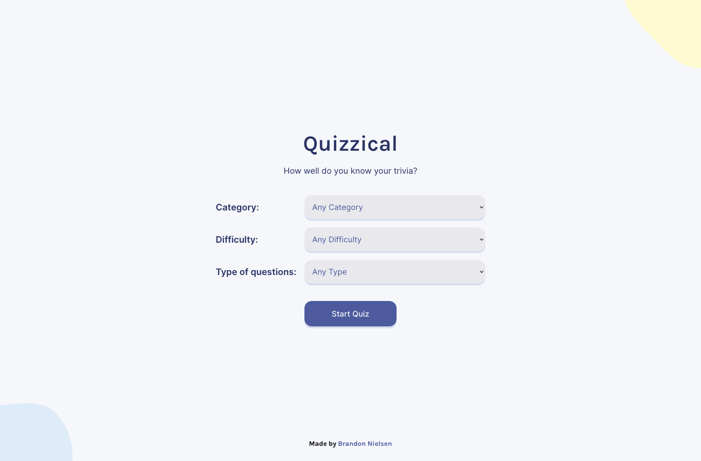
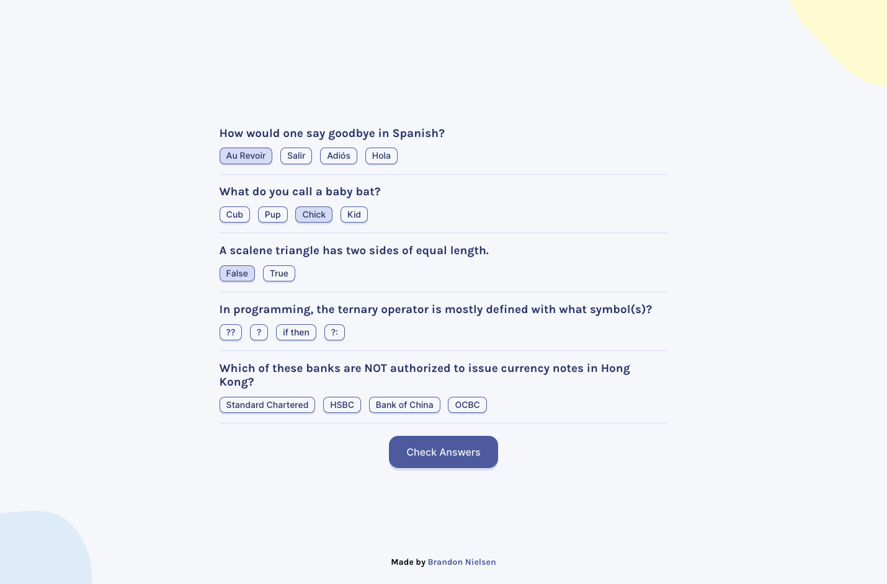
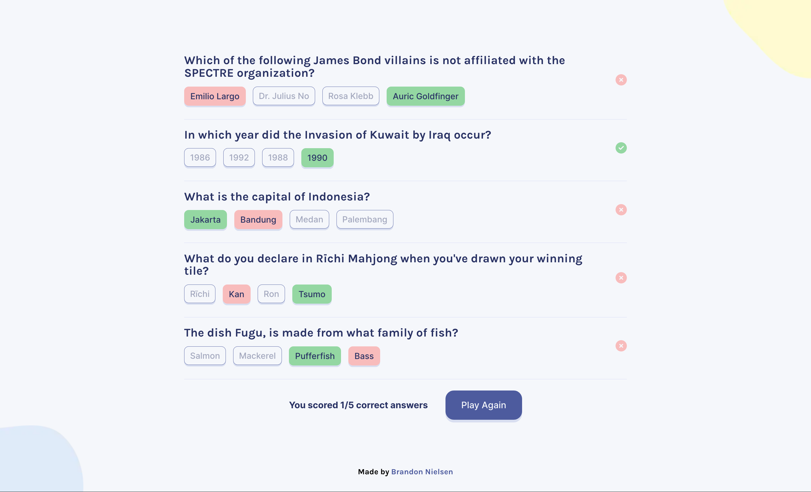
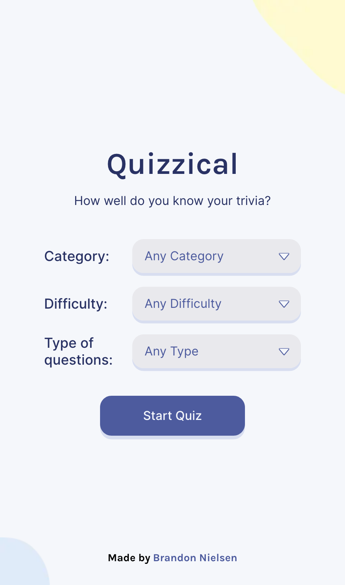
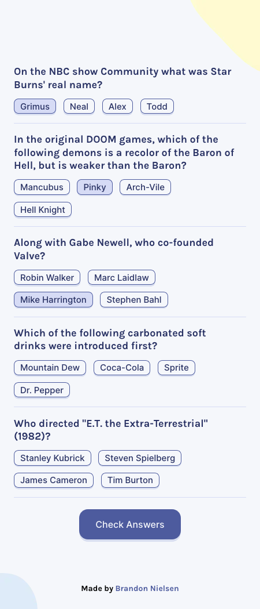

# Quizzical

## Table of Contents

- [Overview](#overview)
  - [Screenshots](#screenshots)
  - [Link](#link)
- [My process](#my-process)
  - [Built with](#built-with)
- [Author](#author)

## Overview

### Screenshots

#### Desktop

#### Mobile

### Link

- Live Site URL: [https://quizzical-v2-bnielsencodes.vercel.app/](https://quizzical-v2-bnielsencodes.vercel.app/)

## My Process

### Built with

- [Next.js App Router](https://nextjs.org/) - React framework
- [React](https://reactjs.org/) - JS library
- [TypeScript](https://typescriptlang.org/)
- [Tailwind CSS](https://tailwindcss.com/)
- [Fetch API](https://developer.mozilla.org/en-US/docs/Web/API/Fetch_API)
- [React Confetti](https://www.npmjs.com/package/react-confetti)
- [CSS Animations](https://www.w3schools.com/css/css3_animations.asp)
- [Inter Typeface - Google Fonts](https://fonts.google.com/?query=inter)
- [Karla Typeface - Google Fonts](https://fonts.google.com/?query=karla)
- [VS Code](https://code.visualstudio.com/) - Integrated development environment

## Author

- Portfolio Website - [bnielsen.dev](https://bnielsen.dev)
- LinkedIn - [/in/bnielsencodes](https://linkedin.com/in/bnielsencodes)
- Twitter - [@bnielsencodes](https://twitter.com/bnielsencodes)
